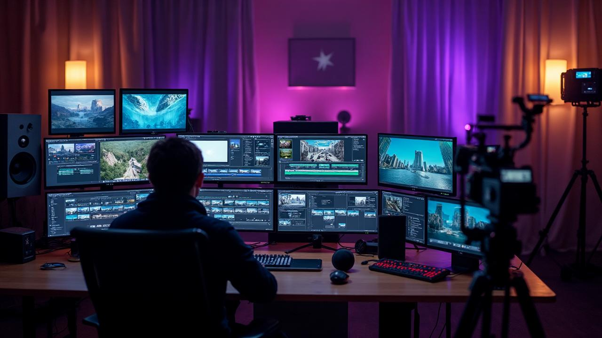

# VideoStream - Professional Video Scene Creation Dashboard

A comprehensive video production platform built with React, Vite, Tailwind CSS, and Supabase. Transform photo folders into professional video scenes with AI-powered workflows, complete with admin approval, version management, and team collaboration.



## 🚀 Features

### Core Functionality
- **Smart Upload Panel**: Drag & drop folder uploads with automatic organization
- **Photo Grid Interface**: Select start/end frames with 6 cinematic shot types
- **AI Scene Generation**: Integration with n8n workflows for video processing
- **Version Management**: Track, regenerate, and manage scene versions
- **Bulk Export**: Download all scenes in organized ZIP packages
- **Real-time Updates**: Live scene status updates via Supabase Realtime

### Admin & Security
- **Admin Approval Workflow**: Email-based user approval system
- **Gmail SMTP Integration**: Automated approval notifications
- **Secure Processing**: HMAC-signed webhook integrations
- **Row Level Security**: Database-level access control
- **User Authentication**: Complete signup/signin flow with profile management

### Keyboard Shortcuts
- `S` - Mark start frame
- `E` - Mark end frame  
- `1-6` - Select shot types (Wide, Medium, Close-up, Extreme Close-up, Over Shoulder, POV)
- `R` - Regenerate scene
- `Del` - Delete scene
- `Ctrl+Z` - Undo last delete (10s window)
- `Ctrl/Cmd+E` - Export all scenes

## 🛠 Tech Stack

- **Frontend**: React 18, TypeScript, Vite
- **Styling**: Tailwind CSS, shadcn/ui components
- **Backend**: Supabase (Database, Auth, Storage, Edge Functions)
- **File Upload**: Uppy Dashboard with folder support
- **Email**: Gmail SMTP with Nodemailer
- **Webhooks**: n8n integration with HMAC security
- **Real-time**: Supabase Realtime subscriptions

## 📋 Prerequisites

Before setting up, ensure you have:

1. **Node.js & npm** - [Install with nvm](https://github.com/nvm-sh/nvm#installing-and-updating)
2. **Supabase Project** - [Create at supabase.com](https://supabase.com)
3. **Gmail App Password** - [Setup instructions below](#gmail-setup)
4. **n8n Instance** - For video processing workflows

## 🔧 Environment Setup

### 1. Supabase Configuration

The project requires these environment variables (already configured in Supabase):

```bash
SUPABASE_URL=https://fmizfozbyrohydcutkgg.supabase.co
SUPABASE_ANON_KEY=eyJhbGciOiJIUzI1NiIsInR5cCI6IkpXVCJ9...
```

### 2. Gmail SMTP Setup

1. **Enable 2-Factor Authentication** on your Gmail account
2. **Generate App Password**:
   - Go to Google Account settings
   - Security → 2-Step Verification → App passwords
   - Generate password for "Mail"
3. **Add to Supabase Secrets**:
   - `SMTP_USER`: hello@panhandle-ai.com
   - `SMTP_PASS`: [Your Gmail App Password]

### 3. n8n Webhook Secret

Generate a secure webhook secret for n8n communication:
- `N8N_WEBHOOK_SECRET`: [Random secure string]

## 🗄 Database Setup

### 1. Run Migrations

The database schema is already deployed with:

- `profiles` - User management with approval status
- `admin_approvals` - Email approval token management  
- `scenes` - Video scene metadata
- `scene_versions` - Version tracking and video URLs
- `storage.objects` - File storage with RLS policies

### 2. Create First Admin

```sql
-- Replace with your admin email and user ID
insert into public.profiles (id, email, role, status)
values ('<your-uuid>', 'hello@panhandle-ai.com', 'admin', 'approved')
on conflict (id) do update set role='admin', status='approved';
```

### 3. Configure Auth Settings

In Supabase Dashboard → Authentication → URL Configuration:
- **Site URL**: `https://your-app-domain.com`  
- **Redirect URLs**: Add your deployed domain

## 🚀 Installation & Development

```bash
# Clone the repository
git clone <your-repo-url>
cd videostream-dashboard

# Install dependencies
npm install

# Start development server
npm run dev
```

The app will be available at `http://localhost:8080`

## 📦 Deployment

### Deploy to Vercel

1. **Connect Repository**: Link your GitHub repo to Vercel
2. **Configure Environment**: Vercel will use Supabase environment variables
3. **Deploy**: Automatic deployment on push to main branch

### Custom Domain Setup

1. **Add Domain** in Vercel dashboard
2. **Update Supabase**: Add custom domain to redirect URLs
3. **Update n8n**: Point webhooks to new domain

## 🔗 API Integration

### n8n Webhook URLs

Configure these endpoints in your n8n workflows:

```
Upload Complete: POST /api/upload/complete
Scene Render: POST /api/scenes/{id}/complete  
Admin Approval: GET /api/admin/approve?token={token}
Admin Rejection: GET /api/admin/reject?token={token}
```

### HMAC Signature Verification

All n8n webhooks must include `X-Hub-Signature-256` header:

```javascript
const signature = crypto
  .createHmac('sha256', process.env.N8N_WEBHOOK_SECRET)
  .update(payload)
  .digest('hex');
```

## 📖 Usage Guide

### For End Users

1. **Sign Up**: Create account at `/auth` 
2. **Wait for Approval**: Admin receives email notification
3. **Upload Photos**: Use drag & drop interface
4. **Create Scenes**: Select frames and shot types
5. **Export Videos**: Download finished scenes as ZIP

### For Admins

1. **Approve Users**: Click email links to approve/reject
2. **Monitor Activity**: View all user profiles in dashboard
3. **Manage Scenes**: Access to all user-generated content

### File Organization

```
media/
├── {user-id}/
│   ├── {folder-name}/
│   │   ├── photo1.jpg
│   │   ├── photo2.jpg
│   │   └── ...
│   └── ...
└── ...
```

## 🔒 Security Features

- **Row Level Security**: Database access control
- **HMAC Webhooks**: Secure n8n communication  
- **JWT Authentication**: Supabase session management
- **Admin Approval**: Gated access to platform
- **Signed URLs**: Temporary file access
- **Input Validation**: Server-side data validation

## 🐛 Troubleshooting

### Common Issues

**"Account Pending" Error**
- Ensure admin has approved your account
- Check email for approval confirmation

**Upload Failures**
- Verify file types are images/videos
- Check storage quota in Supabase
- Ensure bucket policies are correct

**Email Not Sending**
- Verify Gmail App Password is correct
- Check SMTP settings in edge function
- Ensure admin email is configured

**n8n Integration Issues**  
- Verify webhook URLs are accessible
- Check HMAC signature implementation
- Monitor edge function logs

### Debug Logs

Check Supabase Edge Function logs:
- Functions → [function-name] → Logs
- Look for error messages and stack traces

## 📞 Support

For technical support or feature requests:
- Email: hello@panhandle-ai.com
- Check edge function logs in Supabase dashboard
- Review database RLS policies for access issues

## 🔄 Version History

- **v1.0.0** - Initial release with core functionality
- Complete upload/scene generation workflow
- Admin approval system
- Real-time updates
- Export functionality

---

Built with ❤️ using Lovable, React, and Supabase